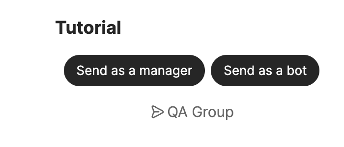
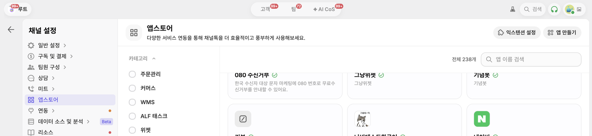
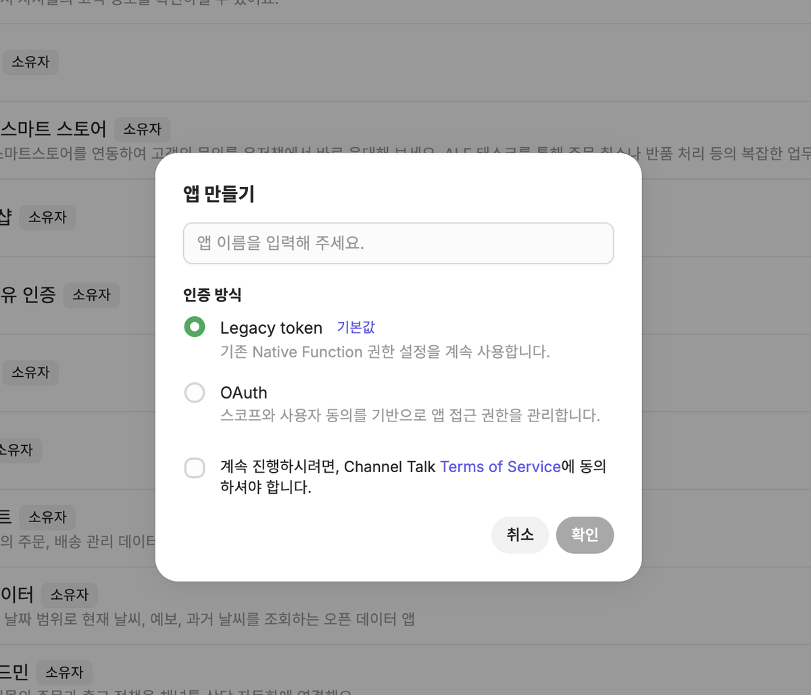
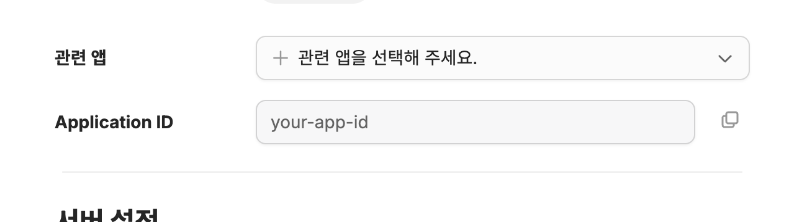
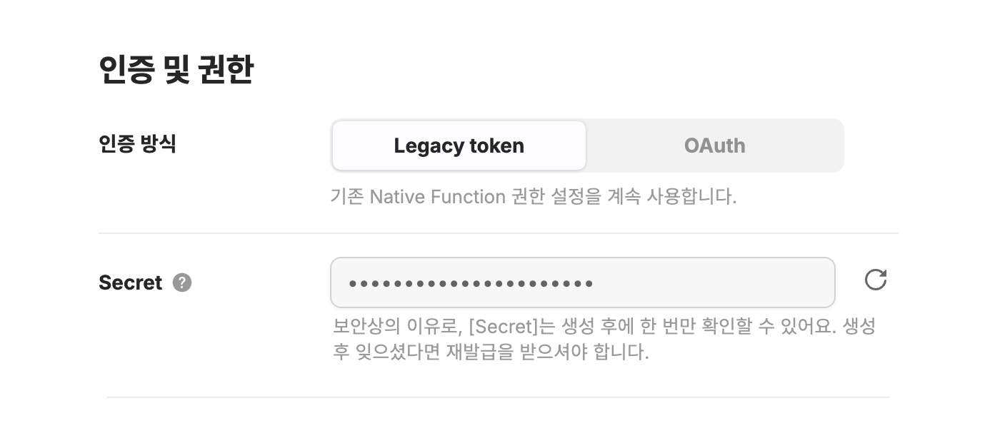
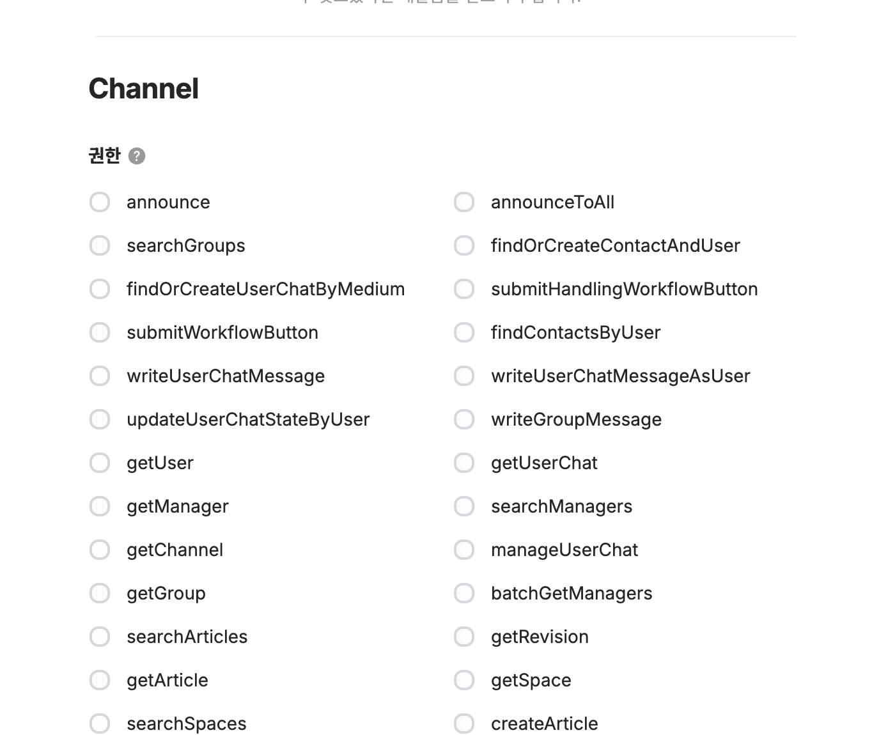
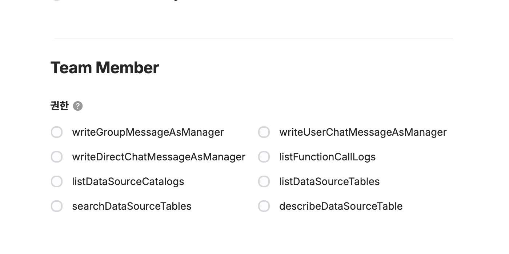
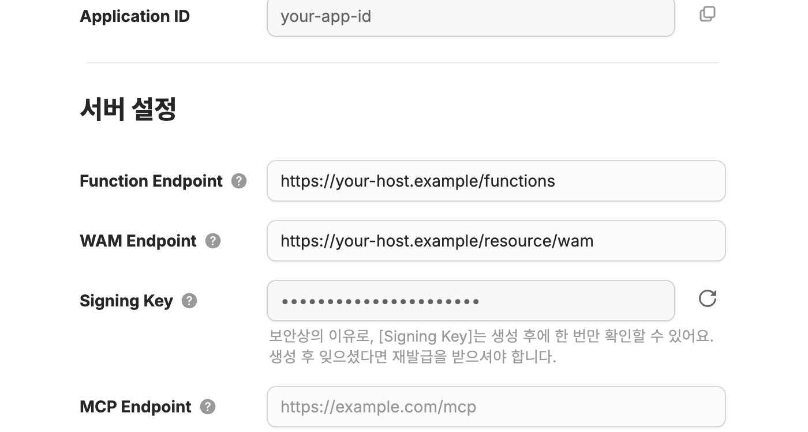
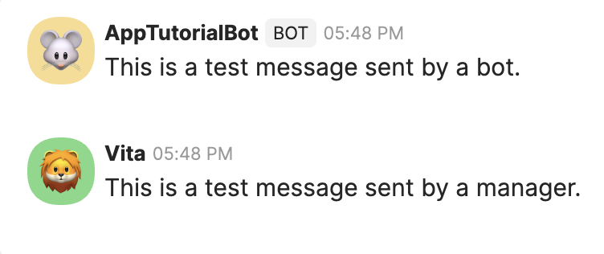

# Build Your First Channel App

In this tutorial, you will build an app that opens a small screen when someone runs `/tutorial` in a Channel conversation. Two buttons on that screen send test messages. We recommend the TypeScript path for your first run. If you use Go, skip to [Use Go instead](#6-use-go-instead).

This is what the finished app looks like:



You only need three terms before you start:

- **Function**: one task performed by your app server. Opening the screen and sending a message are Functions in this tutorial.
- **Extension**: a configuration that connects your Functions to a Channel feature. Here it connects the `/tutorial` Command.
- **WAM**: your app's screen inside Channel. This tutorial's WAM shows two message buttons.

The SDK verifies signed Function requests, registers the Extension, and connects the WAM to your server. You do not need to implement that plumbing yourself.

## 1. Before you start

You need:

- an account with access to the Channel developer portal;
- Node.js 20.11 or newer and Corepack;
- Git;
- an HTTPS tunnel tool that can expose your local server, such as [ngrok](https://ngrok.com/).

Open App Store from Channel settings. Expand **Advanced features**, then select **Create app** to open the Channel Developer Portal.



Enter a development name, keep **Legacy token** as the authentication method, accept the terms, and create the app. This tutorial uses the Legacy token Native Function permissions.



**Success:** Continue when the new app's **Basic Information** page opens.

**First check if it fails:** If Advanced features or Create app is absent, confirm that you have permission to create an app in that Channel.

## 2. Configure the app and permissions

Find the Application ID under **Basic Information**.



Issue a Secret under **Authentication & Permissions → Legacy token** and a Signing Key under **Basic Information → Server Settings**.



The Application ID is a public identifier. The Secret and Signing Key are server-only secrets shown only once after they are generated. Store them safely and never put them in Git, documentation, WAM code, or logs.

Under **Authentication & Permissions → Legacy token**, enable only the permissions used by this tutorial:

- Channel: `writeGroupMessage`
- Team Member: `writeGroupMessageAsManager`





**Success:** Continue after you have the Application ID, Secret, and Signing Key and both permissions are enabled.

**First check if it fails:** If you lose a secret or Signing Key, issue a new one in the developer portal instead of guessing or reusing another value.

## 3. Run the TypeScript tutorial

Clone the tutorial and create its environment file:

```bash
git clone https://github.com/channel-io/app-tutorial-ts.git
cd app-tutorial-ts
corepack enable
cp server/.env.example server/.env
```

Put the values from the previous step in `server/.env`:

```dotenv
APP_ID=your-app-id
APP_SECRET=your-app-secret
SIGNING_KEY=your-hex-signing-key
```

Install dependencies, then build and verify the project:

```bash
corepack pnpm install --frozen-lockfile
corepack pnpm build
corepack pnpm test
corepack pnpm typecheck
```

Start the server after every command passes:

```bash
corepack pnpm start
```

**Success:** The terminal should report that the server is listening on port `3000`. Keep this terminal running.

**First check if it fails:** Check your Node.js version and the first reported error. Do not disable signature verification or skip a failed command.

## 4. Connect the server to Channel

Open another terminal and expose local port `3000` over HTTPS. This example uses ngrok:

```bash
ngrok http 3000
```

Copy the HTTPS address shown next to `Forwarding`. We call that address `https://YOUR_HOST` below.

Enter these two addresses under **Basic Information → Server Settings** in the developer portal:

| Setting           | Value                            |
| ----------------- | -------------------------------- |
| Function Endpoint | `https://YOUR_HOST/functions`    |
| WAM Endpoint      | `https://YOUR_HOST/resource/wam` |



Do not append `/v1` to the Function Endpoint or `/tutorial` to the WAM Endpoint. Save the settings, then restart the app server once.

**Success:** Confirm that Extension registration and the Function-list request succeed separately in the server log. Continue when the `/tutorial` Command metadata is accepted without an error.

**First check if it fails:** Recheck the Application ID, Secret, and tunnel address. If the tunnel address changes, update both endpoints in the developer portal.

## 5. Run it in a test Channel

Install the private app in a test Channel from the developer portal. Refresh the installation if the app is already installed.

1. Open a Channel group conversation.
2. Enter `/tutorial` in the message field and run the Command.
3. When the WAM opens, select the app-bot button and then the manager button.

You are done when both messages arrive:



**Success:** You should see one message from the app bot and one from the current manager.

**First check if it fails:** If `/tutorial` is absent, check Extension registration, the `extension.core.function.getFunctions` request, and Command metadata validation in the server log, then reinstall or refresh the app. If the WAM opens but sending fails, check the permissions in [Troubleshooting](#8-troubleshooting).

## 6. Use Go instead

Follow this section instead of the TypeScript path if you use Go. You need Go 1.25 plus Node.js and Corepack for the WAM build.

```bash
git clone https://github.com/channel-io/app-tutorial.git
cd app-tutorial
corepack enable
cp .env.example .env
```

Enter `APP_ID`, `APP_SECRET`, and `SIGNING_KEY` in `.env`, then load them into the current shell:

```bash
set -a
. ./.env
set +a
```

Build and test the project, then start the server:

```bash
make build
make test
make run
```

Expose port `3022` from another terminal:

```bash
ngrok http 3022
```

As in the TypeScript path, set the Function Endpoint to `https://YOUR_HOST/functions` and the WAM Endpoint to `https://YOUR_HOST/resource/wam`. You can also check the Go server at `http://localhost:3022/ping`. Then follow [Run it in a test Channel](#5-run-it-in-a-test-channel).

**Success:** `make test` passes and the server log reports listener startup and successful Extension registration.

**First check if it fails:** If `make run` exits immediately, confirm that all three values from `.env` are loaded in the current shell.

## 7. What the SDK handled

After your first successful run, you can understand the flow as four steps:

1. The SDK registers the `command:v1` Extension so Channel knows about the `/tutorial` Command.
2. Running the Command calls the `tutorial.open` Function, which opens the WAM.
3. The app-bot button calls the app server's `tutorial.sendAsBot` Function.
4. The manager button uses the WAM's `useNativeFunction` with the current manager's authorization.

On the server, the SDK publishes Function schemas, verifies `x-signature`, and manages app and Channel tokens. More specifically, `TokenManager` reuses tokens while the SDK makes the `registerExtension(appId, extensionName, systemVersion)` call and answers Function discovery. In the WAM, `useCallFunction` routes an app Function call through AppStore to your server.

Read [Concepts](concepts.md#authentication-signatures-and-tokens), [Function registration](functions.md), the [Command guide](extensions/command.md), and the [WAM guide](wam.md) when you need to change these internals.

## 8. Troubleshooting

| Symptom                       | First check                                                                 |
| ----------------------------- | --------------------------------------------------------------------------- |
| Extension registration fails  | Application ID and Secret, public HTTPS address, and server restart         |
| `401` or signature error      | The Signing Key is entered as the original hex string                       |
| `/functions/v1` returns `404` | The Function Endpoint in the portal ends with `/functions`                  |
| WAM does not open             | The WAM Endpoint ends with `/resource/wam` and the WAM build passed         |
| Manager message fails         | `writeGroupMessageAsManager`, group conversation, and current manager login |
| Bot message fails             | `writeGroupMessage` and whether the app is installed in the current Channel |

Use `SKIP_SIGNATURE_VERIFICATION=true` only for isolated local debugging. Never paste the Secret, Signing Key, or access/refresh tokens into an issue or log.

## Where to go next

1. Learn how Function, Extension, and WAM fit together in [Concepts](concepts.md).
2. Extend server behavior and the Command with [Function registration](functions.md) and the [Command guide](extensions/command.md).
3. Extend the screen and Function calls with the [WAM guide](wam.md).
4. Choose other capabilities in the [Extension guide](extensions.md).
5. Use the [production readiness guide](app-development.md) before launch.
6. Find language-specific APIs in the [TypeScript reference](../../reference/typescript/README.md) and [Go reference](../../reference/go/README.md).

See the complete implementation in the [TypeScript tutorial](https://github.com/channel-io/app-tutorial-ts) or [Go tutorial](https://github.com/channel-io/app-tutorial).
